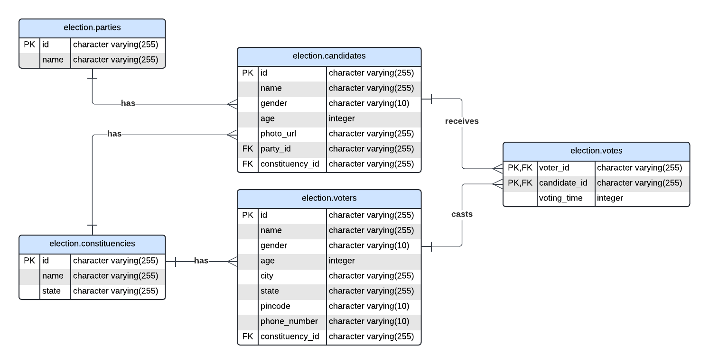
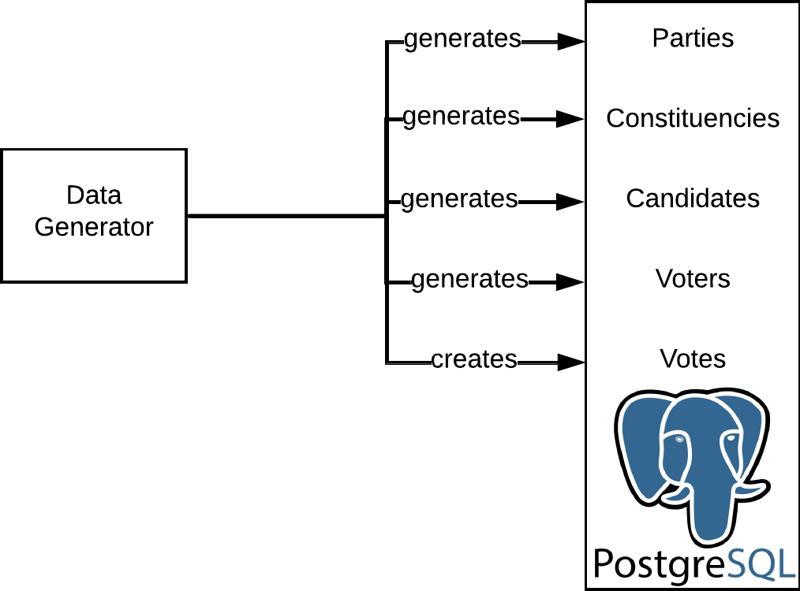
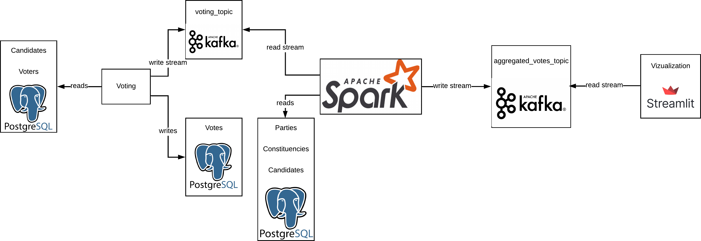

# election-analysis
This repo contains the code for real-time election voting analysis system for an Indian Rajya Sabha Election.


## Table of Contents
1. [Introduction](#introduction)
2. [Architecture](#architecture)
3. [Technologies](#technologies)
4. [Pre-requisites](#pre-requisites)
5. [Setup](#setup)
6. [Usage](#usage)

## Introduction
This repo contains the code for real-time election voting analysis system. The system is designed to analyze the election voting data in real-time and provide the results on a dashboard.

## Architecture

Election Database ER Design


Sample Data Generation Flow


Election System Flow


## Technologies
The system is built using the following technologies:
- Python : The main programming language.
- Apache Spark : For processing the data.
- Kafka : For streaming the data.
- Docker: For containerization.
- Postgres : For storing the candidate, parties, constituencies, voter & voting data
- Streamlit : For creating the real-time dashboard.

## Pre-requisites
Ensure that the following are installed on your machine before running the code:
- Docker
- Python 3.11 & pip
- Apache spark 3.5.0

## Setup
1. Clone the repo
```bash
git clone https://github.com/SatyatejaP/election-analysis.git
```
2. Install the required packages
```bash
pip install -r requirements.txt
```

## Usage
1. Run the docker-compose file
```bash
docker-compose up
```
2. Run the sample data generator
```bash
python sample_data_generator.py
```
3. Once the Sample Data Generator complestes, Run the voting process
```bash
python do_voting.py
```
4. Run the spark analysis job
```bash
python realtime_analysis.py
```
5. Run the streamlit dashboard
```bash
streamlit run dashboard.py
```